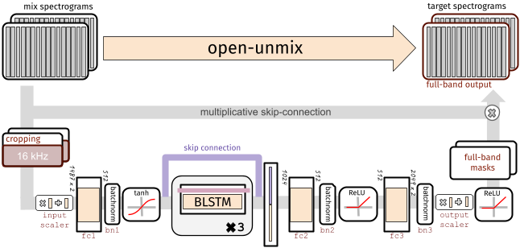
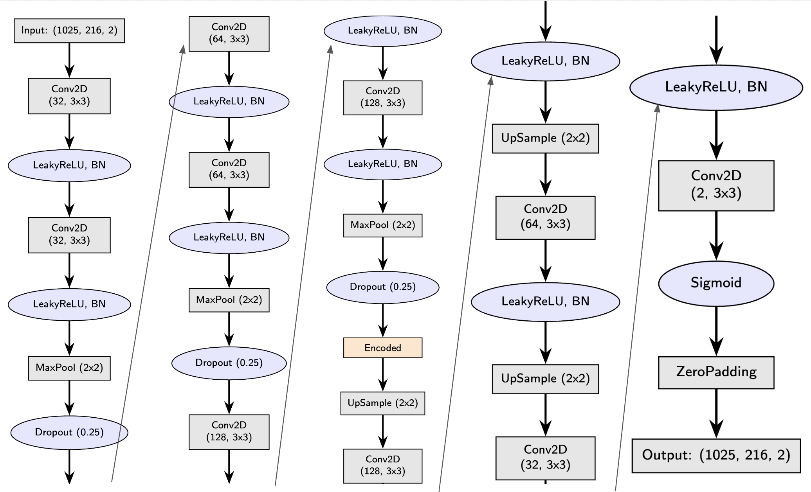
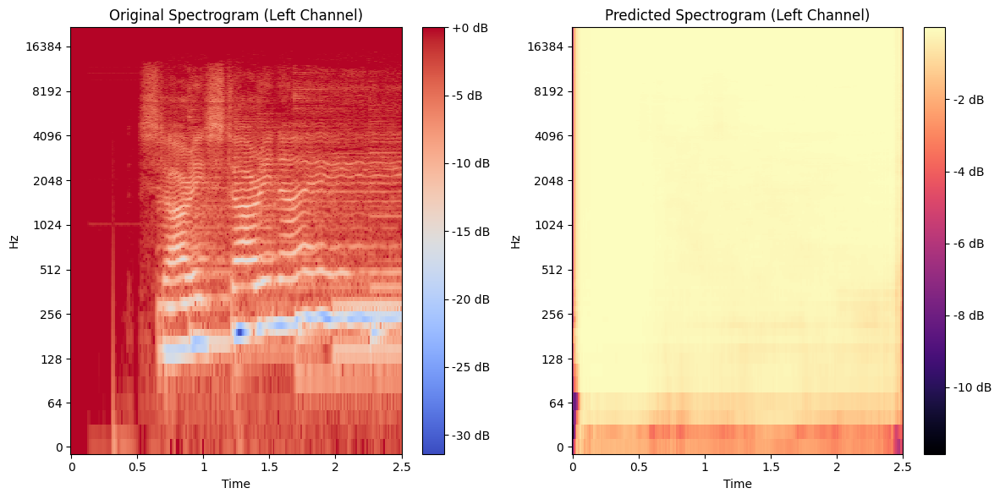
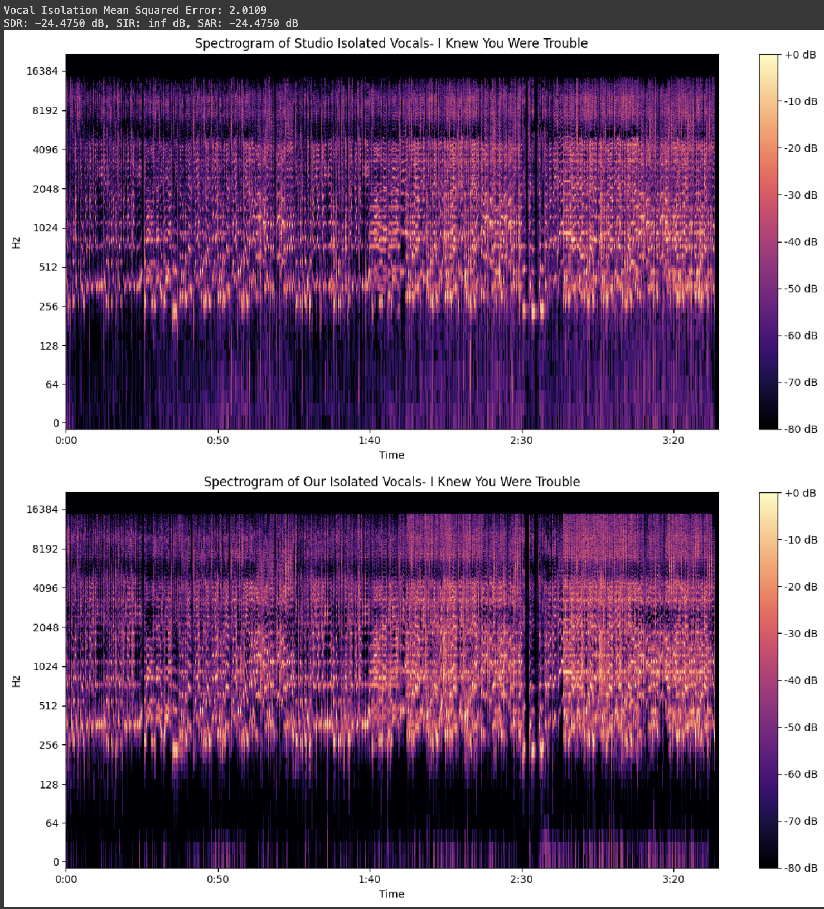
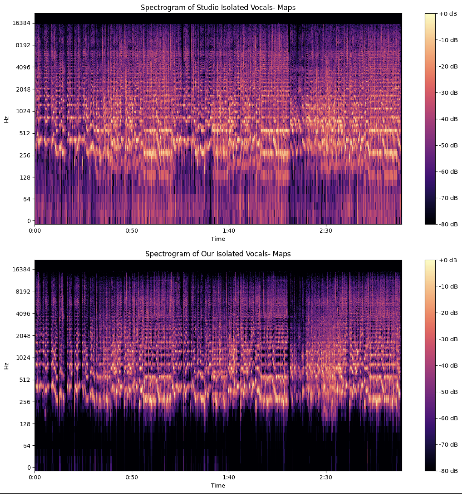
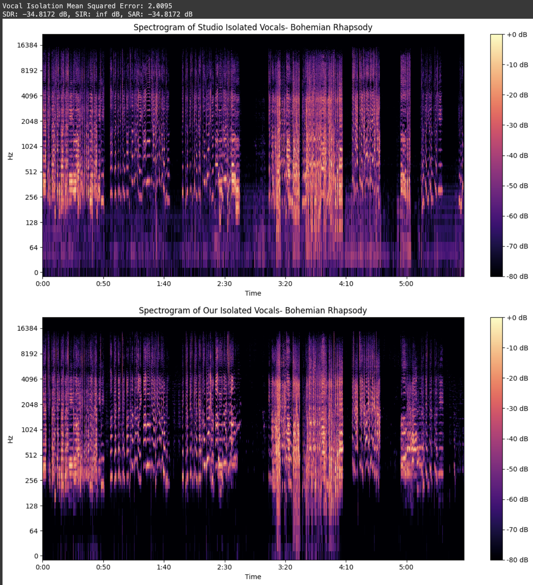

# Deep Learning for Vocal Isolation and Profanity Filtering

[https://youtube.com/playlist?list=PLuGq_O7Y2F2vW0nbue0JwZZzZnLrZbK9d&si=U_B0JxrNgnoYkc3c](https://youtube.com/playlist?list=PLuGq_O7Y2F2vW0nbue0JwZZzZnLrZbK9d&si=U_B0JxrNgnoYkc3c)

**Yusuf Morsi**  
Department of Electrical and Computer Engineering  
University of California, San Diego  
La Jolla, CA 92093  
ymorsi@ucsd.edu

## File Structure

- **images/**
  - AE.png
  - bohemian.png
  - diana.png
  - maps.png
  - noise.png
  - OU.png
  - trouble.png
- CSE190.pdf
- FAILURE.ipynb
- README.md
- SUCCESSFUL.ipynb

## Abstract

This report discusses my project, in which I take in audio tracks in order to isolate vocals and mute profanity. Returned tracks include the isolated vocals, the isolated vocals with the profanity muted, and the original track without profanity. The main goal of this project is to transform a song with instruments and inappropriate vocals in order to make it more user-friendly. Some avoid listening to music with instruments due to them causing headaches, so this is a solution that heeds that issue. When it comes to profanity in music, a more obvious problem, some prefer songs without curse words. This can be done either by businesses who want to play child-friendly music or parents that do not want their children listening to profanity. This project uses advanced audio processing and machine learning techniques. The final solution uses Open-Unmix for vocal isolation and Google Speech-to-Text for profanity detection (Pydub is also used to mute curse words).

## 1. Introduction

The music industry is currently at a stage where new technologies are constantly being introduced to manipulate audio. This project focuses on processing music tracks to isolate musical instruments and remove profanity. The primary goal is to take a song with instrumental, vocal, and profanity elements and produce an output that not only removes the unwanted elements but also returns in a clean, low-noise manner. This profanity-removal aspect has numerous applications, including creating clean versions of songs for radio stations, businesses, or personal use.

The project implements advanced ML and audio-processing techniques in order to achieve its objectives. This mainly involves using deep learning models to separate vocals from instrumentals, followed by the application of speech recognition algorithms (namely Google Cloud Speech-to-Text) to detect and mute profane words. Two different model architectures were explored: one using a state-of-the-art pre-trained model that is able to successfully isolate vocals, and another that applies an autoencoder-based neural network which was unfortunately less effective when it comes to runtime, efficiency, and noise. The challenges, methodologies, and outcomes of these approaches are discussed in detail.

## 2. Related Works

Vocal isolation has been a significant area of research in audio signal processing. There are multiple models that compete in vocal isolation, the best being BandSplit RNN, and follow-ups including Hybrid Demucs, DEMUCS, Conv-TasNET. Open-Unmix, the model we used, ranks as number 15 in overall SDR (score to distortion).

**Source:** [https://paperswithcode.com/sota/music-source-separation-on-musdb18?p=open-unmix-a-reference-implementation-fo](https://paperswithcode.com/sota/music-source-separation-on-musdb18?p=open-unmix-a-reference-implementation-fo)

## 3. Architecture

### 3.1 Open-Unmix Model

The Open-Unmix (UMX) model is a highly ranked and used model designed for music source separation (bass, drums, and vocals). It operates through multiple steps:

- **Spectrogram Transformation:** First, the input is converted into spectrogram format with STFT.

- **Neural Network:**
  - **Encoder:** As expected of a neural network, we have an encoder. This model uses Bi-LSTM networks to find temporal movement and features from the spectrogram.
  - **Bottleneck:** As expected once again, we have a bottleneck, which reduces the dimensionality while still keeping important features.
  - **Decoder:** We now have a decoder that reconstructions the spectrogram, and allows us to have an output to investigate.

- **Training:** This model is trained on the MUSDB18HQ dataset, which has 150 music tracks, all of which are isolated. The goal here is to minimize MSE between the predictions and real spectrograms.

- **Output:** The model subsequently brings the isolated spectrogram back to the time domain, which produces vocal tracks without the instruments. Below is the architecture of the Open-Unmix model, showing a lower-level explanation.

### 3.2 Autoencoder-Based Neural Network

Our autoencoder implements a convolutional neural network to isolate the vocals, also using the MUSDB18HQ dataset. Our architecture is mainly consisting of two components that we have seen in Open Unmix’s model: the encoder and the decoder.

#### 3.2.1 Encoder

The encoder compresses the input audio spectrogram into a lower-dimensional representation, capturing the essential features needed for reconstruction. The encoder consists of three sequential convolutional blocks, each with:

- **Conv2D Layers:** 2D convolutional with 3x3 filters (32, 64, 128 filters).
- **LeakyReLU:** After each layer, a LeakyReLU activation function is implemented so more hectic patterns are recognized.
- **Batch Normalization:** Batch normalization layers are used to normalize the inputs to each layer.
- **MaxPooling and Dropout:** After each block, we have a max pooling layer (2x2), which is used to reduce the spatial dimensions. The dropout layer (0.25) is implemented to prevent overfitting by randomly deactivating certain neurons during training.

- **Layer 1 & 2:** Conv2D (32 filters, 3x3) -> LeakyReLU -> BatchNorm
- **Layer 3 & 4:** Conv2D (64 filters, 3x3) -> LeakyReLU -> BatchNorm
- **Layer 5 & 6:** Conv2D (128 filters, 3x3) -> LeakyReLU -> BatchNorm

The encoder outputs an encoded representation that captures the most salient features of the input spectrogram, significantly reducing its dimensionality.

#### 3.2.2 Decoder

The decoder aims to reconstruct the input data from the encoded representation. It mirrors the encoder’s structure but in reverse order, expanding the data back to its original dimensions:

- **UpSampling Layers:** The decoder begins with three upsampling layers (2x2) that increase the spatial dimensions of the encoded data, preparing it for reconstruction.
- **Conv2D Layers:** Counterpart of that in encoder
- **LeakyReLU and Batch Normalization:** Stabilizes the learning (similar to encoder counterpart)
- **Final Conv2D Layer:** This uses 2 filters and a sigmoid activation function to output the reconstructed song spectrogram.
- **ZeroPadding2D:** This makes sure the output matches the input dimensions.

- **Layer 7 & 8:** Conv2D (128 filters, 3x3) -> LeakyReLU -> BatchNorm
- **Layer 9 & 10:** Conv2D (64 filters, 3x3) -> LeakyReLU -> BatchNorm
- **Layer 11 & 12:** Conv2D (32 filters, 3x3) -> LeakyReLU -> BatchNorm

## 4. Experiments

### 4.1 Dataset and Preprocessing

The MUSDB18-HQ dataset was used for our training, which has high-quality tracks with different stems for vocals, bass, drums, and other. The data was split into training and test sets, and covered a multitude of genres. In both models, we converted our songs into spectrograms using STFT, normalized, and padded for uniform input dimensions.

### 4.2 Model Training and Evaluation

#### 4.2.1 Open-Unmix Model

- **Training:** Pretrained on the Musdb18 dataset, which saved us time in detecting certain patterns. To reiterate, our training goal is to minimize MSE between the predicted and real spectrograms.
  
- **Evaluation:** The model was evaluated using Signal-to-Distortion Ratio (SDR), Signal-to-Interference Ratio (SIR), and subjective listening tests, as observed in images. We were able to compare our isolated vocal tracks with the official acapella.

#### 4.2.2 Autoencoder-based Model

- **Training:** The model was trained from scratch using the same dataset, and we wanted to optimize reconstruction error.

- **Evaluation:** For performance, we had issues due to noise and pauses, especially in songs with complex arrangements.

## 5. Results

### 5.1 Vocal Isolation Performance

The models were tested on several songs, including ’I Knew You Were Trouble’, ’Dirty Diana’, ’Bohemian Rhapsody’, and ’Maps’. The focused performance metrics were the mean squared error and spectrogram comparative analysis. The results for the Open-Unmix model are illustrated in Figures 4, 5, 6, and 7.

The spectrogram for ’I Knew You Were Trouble’ (Figure 4) shows the effectiveness of the Open-Unmix model, as the spectrograms are very similar. Furthermore, the mean squared error for this track was 2.0109, showing excellent isolation.

For ’Dirty Diana’ (Figure 5), the model also shows a successful vocal extraction with an MSE of 1.9992.

The popular song, ’Bohemian Rhapsody’ (Figure 6) was processed, with the model achieving an MSE of 2.0095. This adds to show the model’s robustness in separating intricate vocal harmonies.

Finally, ’Maps’ (Figure 7) also shows Open Unmix’s model’s consistent performance across different genres, showing very similar spectrograms.

### 5.2 Profanity Detection Performance

The system’s effectiveness in detecting and muting profanity was evaluated using transcription accuracy and profanity metrics:

- **Recognized Lyrics (Excerpt):** ...Little stupid as\* I’ll give I’ll give I’ll give a fuk b\*tch I don’t give up fu\*k about you or anything that you do don’t give up about you or anything that you

- **Transcription Accuracy:** 27.91%

- **Profanity Metrics:**
  - **Ground Truth Curse Words:** [’fu\*k’, ’as\*’, ’as\*’, ’as\*’, ’fu\*k’, ’fu\*k’, ’fu\*k’, ’fu\*k’, ’sh\*t’, ’fu\*k’, ’fu\*k’, ’fu\*k’, ’sh\*t’, ’bi\*ch’, ’bi\*ch’, ’bi\*ch’, ’as\*’, ’as\*’, ’fu\*k’, ’as\*’, ’as\*’, ’as\*’, ’fu\*k’, ’fu\*k’, ’fu\*k’, ’fu\*k’, ’ni\*gas’, ’ni\*gas’, ’bi\*ch’, ’sh\*t’, ’ni\*ga’, ’bi\*ch’, ’ni\*gas’, ’ni\*gas’, ’as\*’, ’as\*’, ’as\*’, ’fu\*k’, ’fu\*k’, ’fu\*k’, ’fu\*k’, ’fu\*k’, ’fu\*k’, ’fu\*k’, ’fu\*k’, ’sh\*t’, ’bi\*ch’, ’bi\*ch’, ’as\*’, ’fuc\*in’]
  
  - **Detected Curse Words:** [’fu\*k’, ’as\*’, ’as\*’, ’fu\*k’, ’fu\*k’, ’fu\*k’, ’bi\*ch’, ’fu\*k’, ’da\*n’, ’as\*’]
  
  - **Misclassified Curse Words:** [’sh\*t’, ’sh\*t’, ’ni\*gas’, ’ni\*gas’, ’sh\*t’, ’ni\*ga’, ’ni\*gas’, ’ni\*gas’, ’sh\*t’, ’fuc\*in’]
  
  - **Misclassified Non-Curse Words:** [’fu\*k’, ’fu\*k’, ’fu\*k’, ’fu\*k’, ’da\*n’]
  
  - **Percent Profanity Removed:** 20.00%

The Open-Unmix model significantly outperformed the autoencoder-based model in both vocal isolation and profanity detection tasks. We find that our profanity removal, which was done with Google Cloud’s function for transcription and Pydub, only worked on 20% of the profanity in the song based on comparative analysis with the official lyrics, yet the audio output proved to mute most curse words (see video presentation).

## 6. Conclusion

This project shows the importance of a properly built neural network when it comes to certain tasks. We found that we were able to construct a pipeline that both removes instruments and curse words with a pre-trained model. The main component of the model from Open Unmix that caused its success was the structure of its neural network, which proves how imperative it is to spend sufficient time constructing it.

